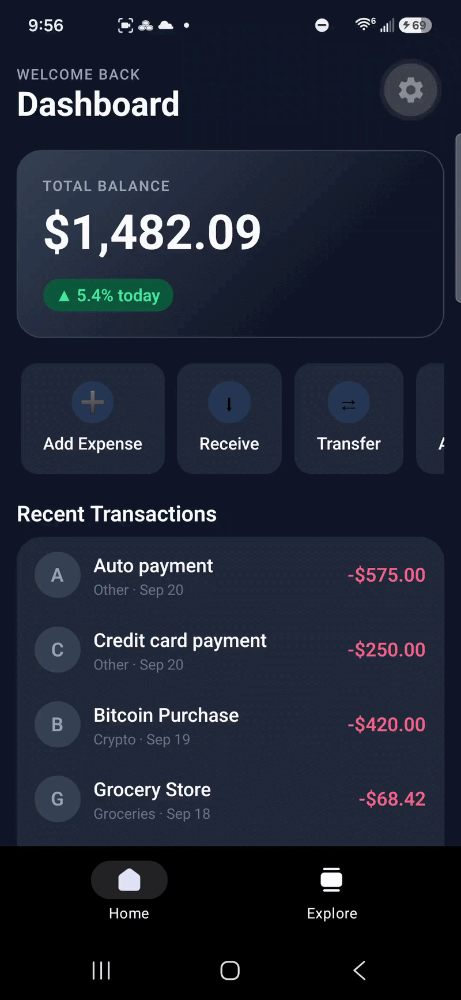
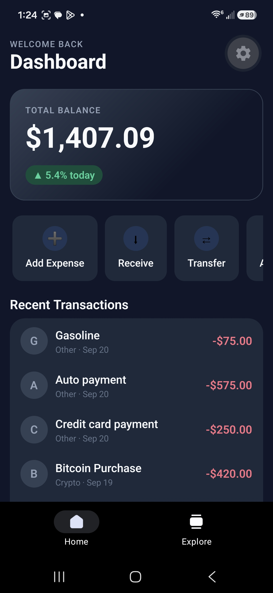
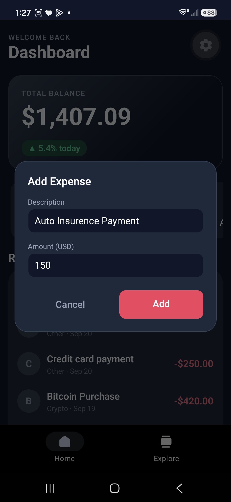
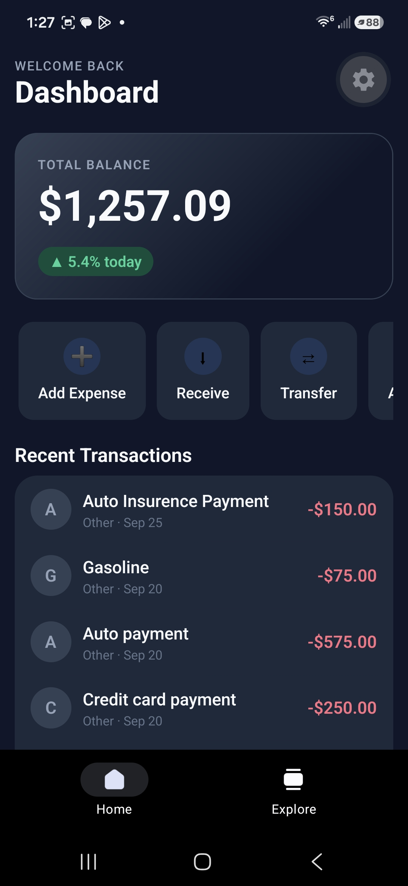

# Crypto Expense Tracker Dashboard

## Demo



<table>
  <tr>
    <td></td>
    <td></td>
    <td></td>
  </tr>
</table>

A cross-platform mobile dashboard for tracking crypto and everyday spending — built with Expo, React Native, and TypeScript. Tested on Android and web; Expo also supports iOS, but that platform hasn't been tested yet.

## Project Overview

This project delivers a financial dashboard built on Expo's latest tooling — Expo Router, the React Native New Architecture, and the React Compiler — and has been tested for smooth performance on mid-range Android devices.

The UI follows a single, consistent design system (deep dark background, emerald for gains, coral/red for losses) applied through Tailwind CSS utility classes via NativeWind, so every screen and component shares the same look and feel without repeated inline styling.

State is centralized in a single Zustand store, keeping data flow predictable: adding a transaction anywhere in the app instantly and automatically updates the balance, the transaction list, and any other component reading from that state — no manual refresh logic required.

## Tech Stack

| Category | Technology |
|---|---|
| Framework | [Expo](https://expo.dev) SDK 57 (React Native New Architecture) |
| UI Library | [React Native](https://reactnative.dev) 0.86 |
| Language | [TypeScript](https://www.typescriptlang.org) (strict mode) |
| Routing | [Expo Router](https://docs.expo.dev/router/introduction/) (file-based) |
| State Management | [Zustand](https://github.com/pmndrs/zustand) |
| Styling | [NativeWind](https://www.nativewind.dev) (Tailwind CSS for React Native) |
| Persistence | AsyncStorage via Zustand's `persist` middleware |
| Animation | React Native Reanimated |

## Key Features Implemented

- **Dynamic, live-updating balance** — the total balance is derived from actual transaction data (not a static number) and recalculates automatically the instant a transaction is added.
- **Modular component architecture** — the dashboard is composed of small, self-contained, reusable components (`BalanceCard`, `QuickActions`, `TransactionHistory`), each independently typed and themeable.
- **Local state persistence** — transactions are saved to on-device storage (AsyncStorage), so a user's data survives app restarts with zero extra configuration.
- **Interactive "Add Expense" flow** — a native-feeling modal lets users add a new expense on the fly, with input validation and an immediate, reactive update to the balance and transaction list.
- **Centralized, type-safe design system** — a single source of truth for color palette and typography scale, consumed consistently by both Tailwind classes and native `StyleSheet`/style objects.
- **Inflow/outflow-colored transaction history** — inflows (income, sales) and outflows (expenses, purchases) are visually distinguished with green/red color coding at a glance.

## How to Run

### Prerequisites

- [Node.js](https://nodejs.org) 18 or later (LTS recommended)
- npm (bundled with Node.js)
- The [Expo Go](https://expo.dev/go) app installed on your iOS or Android device — or an iOS Simulator / Android Emulator set up locally

### Steps

1. **Clone the repository**

   ```bash
   git clone https://github.com/Rafin86/crypto-expense-tracker-dashboard.git
   cd crypto-expense-tracker-dashboard
   ```

2. **Install dependencies**

   ```bash
   npm install
   ```

3. **Start the development server**

   ```bash
   npx expo start
   ```

4. **Open the app**

   - Scan the QR code shown in the terminal with the **Expo Go** app (Android: use the in-app scanner; iOS: use the Camera app) to run it on your own device.
   - Or press `a` in the terminal to launch an Android emulator, `i` for an iOS simulator, or `w` to open it in a web browser.

No additional setup, API keys, or backend services are required — the app runs entirely on local, on-device state.

## License

This project is licensed under the MIT License — see [`LICENSE`](./LICENSE) for details.
